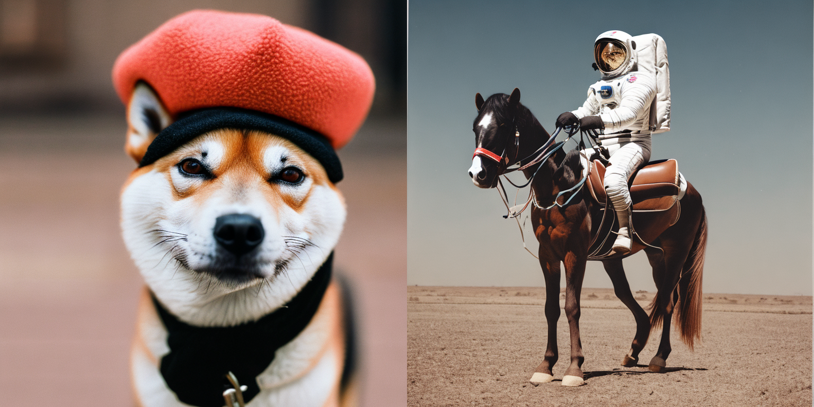

# X-Do Image




This repository contains [Stable Diffusion](https://github.com/CompVis/stable-diffusion) models trained from scratch and will be continuously updated with
new checkpoints. The following list provides an overview of all currently available models. More coming soon.
  
## Requirements

You can update an existing [latent diffusion](https://github.com/CompVis/latent-diffusion) environment by running

```
conda install pytorch==1.12.1 torchvision==0.13.1 -c pytorch
pip install transformers==4.19.2 diffusers invisible-watermark
pip install -e .
``` 
#### xformers efficient attention
For more efficiency and speed on GPUs, 
we highly recommended installing the [xformers](https://github.com/facebookresearch/xformers)
library.

Tested on A100 with CUDA 11.4.
Installation needs a somewhat recent version of nvcc and gcc/g++, obtain those, e.g., via 
```commandline
export CUDA_HOME=/usr/local/cuda-11.4
conda install -c nvidia/label/cuda-11.4.0 cuda-nvcc
conda install -c conda-forge gcc
conda install -c conda-forge gxx_linux-64==9.5.0
```

Then, run the following (compiling takes up to 30 min).

```commandline
cd ..
git clone https://github.com/facebookresearch/xformers.git
cd xformers
git submodule update --init --recursive
pip install -r requirements.txt
pip install -e .
cd ../stablediffusion
```
Upon successful installation, the code will automatically default to [memory efficient attention](https://github.com/facebookresearch/xformers)
for the self- and cross-attention layers in the U-Net and autoencoder.

## General Disclaimer
Stable Diffusion models are general text-to-image diffusion models and therefore mirror biases and (mis-)conceptions that are present
in their training data. Although efforts were made to reduce the inclusion of explicit pornographic material, **we do not recommend using the provided weights for services or products without additional safety mechanisms and considerations.
The weights are research artifacts and should be treated as such.**

## Stable Diffusion v2

Stable Diffusion v2 refers to a specific configuration of the model
architecture that uses a downsampling-factor 8 autoencoder with an 865M UNet
and OpenCLIP ViT-H/14 text encoder for the diffusion model. The _SD 2-v_ model produces 768x768 px outputs. 

Evaluations with different classifier-free guidance scales (1.5, 2.0, 3.0, 4.0,
5.0, 6.0, 7.0, 8.0) and 50 DDIM sampling steps show the relative improvements of the checkpoints:


### Text-to-Image


Stable Diffusion 2 is a latent diffusion model conditioned on the penultimate text embeddings of a CLIP ViT-H/14 text encoder.
We provide a [reference script for sampling](#reference-sampling-script).
#### Reference Sampling Script

This script incorporates an [invisible watermarking](https://github.com/ShieldMnt/invisible-watermark) of the outputs, to help viewers [identify the images as machine-generated](scripts/tests/test_watermark.py).
We provide the configs for the _SD2-v_ (768px) and _SD2-base_ (512px) model.

To sample from the _SD2.1-v_ model, run the following:

```
python scripts/txt2img.py --prompt "a professional photograph of an astronaut riding a horse" --ckpt <path/to/768model.ckpt/> --config configs/stable-diffusion/v2-inference-v.yaml --H 768 --W 768  
```
or try out the Web Demo: [](https://huggingface.co/spaces/stabilityai/stable-diffusion).

To sample from the base model, use
```
python scripts/txt2img.py --prompt "a professional photograph of an astronaut riding a horse" --ckpt <path/to/model.ckpt/> --config <path/to/config.yaml/>  
```

By default, this uses the [DDIM sampler](https://arxiv.org/abs/2010.02502), and renders images of size 768x768 (which it was trained on) in 50 steps. 
Empirically, the v-models can be sampled with higher guidance scales.

Note: The inference config for all model versions is designed to be used with EMA-only checkpoints. 
For this reason `use_ema=False` is set in the configuration, otherwise the code will try to switch from
non-EMA to EMA weights. 

#### Enable Intel® Extension for PyTorch* optimizations in Text-to-Image script

If you're planning on running Text-to-Image on Intel® CPU, try to sample an image with TorchScript and Intel® Extension for PyTorch* optimizations. Intel® Extension for PyTorch* extends PyTorch by enabling up-to-date features optimizations for an extra performance boost on Intel® hardware. It can optimize memory layout of the operators to Channel Last memory format, which is generally beneficial for Intel CPUs, take advantage of the most advanced instruction set available on a machine, optimize operators and many more.

**Prerequisites**

Before running the script, make sure you have all needed libraries installed. (the optimization was checked on `Ubuntu 20.04`). Install [jemalloc](https://github.com/jemalloc/jemalloc), [numactl](https://linux.die.net/man/8/numactl), Intel® OpenMP and Intel® Extension for PyTorch*.

```bash
apt-get install numactl libjemalloc-dev
pip install intel-openmp
pip install intel_extension_for_pytorch -f https://software.intel.com/ipex-whl-stable
```

To sample from the _SD2.1-v_ model with TorchScript+IPEX optimizations, run the following. Remember to specify desired number of instances you want to run the program on ([more](https://github.com/intel/intel-extension-for-pytorch/blob/master/intel_extension_for_pytorch/cpu/launch.py#L48)).

```
MALLOC_CONF=oversize_threshold:1,background_thread:true,metadata_thp:auto,dirty_decay_ms:9000000000,muzzy_decay_ms:9000000000 python -m intel_extension_for_pytorch.cpu.launch --ninstance <number of an instance> --enable_jemalloc scripts/txt2img.py --prompt \"a corgi is playing guitar, oil on canvas\" --ckpt <path/to/768model.ckpt/> --config configs/stable-diffusion/intel/v2-inference-v-fp32.yaml  --H 768 --W 768 --precision full --device cpu --torchscript --ipex
```

To sample from the base model with IPEX optimizations, use

```
MALLOC_CONF=oversize_threshold:1,background_thread:true,metadata_thp:auto,dirty_decay_ms:9000000000,muzzy_decay_ms:9000000000 python -m intel_extension_for_pytorch.cpu.launch --ninstance <number of an instance> --enable_jemalloc scripts/txt2img.py --prompt \"a corgi is playing guitar, oil on canvas\" --ckpt <path/to/model.ckpt/> --config configs/stable-diffusion/intel/v2-inference-fp32.yaml  --n_samples 1 --n_iter 4 --precision full --device cpu --torchscript --ipex
```

If you're using a CPU that supports `bfloat16`, consider sample from the model with bfloat16 enabled for a performance boost, like so

```bash
# SD2.1-v
MALLOC_CONF=oversize_threshold:1,background_thread:true,metadata_thp:auto,dirty_decay_ms:9000000000,muzzy_decay_ms:9000000000 python -m intel_extension_for_pytorch.cpu.launch --ninstance <number of an instance> --enable_jemalloc scripts/txt2img.py --prompt \"a corgi is playing guitar, oil on canvas\" --ckpt <path/to/768model.ckpt/> --config configs/stable-diffusion/intel/v2-inference-v-bf16.yaml --H 768 --W 768 --precision full --device cpu --torchscript --ipex --bf16
# SD2.1-base
MALLOC_CONF=oversize_threshold:1,background_thread:true,metadata_thp:auto,dirty_decay_ms:9000000000,muzzy_decay_ms:9000000000 python -m intel_extension_for_pytorch.cpu.launch --ninstance <number of an instance> --enable_jemalloc scripts/txt2img.py --prompt \"a corgi is playing guitar, oil on canvas\" --ckpt <path/to/model.ckpt/> --config configs/stable-diffusion/intel/v2-inference-bf16.yaml --precision full --device cpu --torchscript --ipex --bf16
```

### Image Modification with Stable Diffusion


#### Depth-Conditional Stable Diffusion

To augment the well-established [img2img](https://github.com/CompVis/stable-diffusion#image-modification-with-stable-diffusion) functionality of Stable Diffusion, we provide a _shape-preserving_ stable diffusion model.

```
python scripts/gradio/depth2img.py configs/stable-diffusion/v2-midas-inference.yaml <path-to-ckpt>
```

or

```
streamlit run scripts/streamlit/depth2img.py configs/stable-diffusion/v2-midas-inference.yaml <path-to-ckpt>
```

This method can be used on the samples of the base model itself.
For example, take [this sample](assets/stable-samples/depth2img/old_man.png) generated by an anonymous discord user.
Using the [gradio](https://gradio.app) or [streamlit](https://streamlit.io/) script `depth2img.py`, the MiDaS model first infers a monocular depth estimate given this input, 
and the diffusion model is then conditioned on the (relative) depth output.

<p align="center">
<b> depth2image </b><br/>

</p>

This model is particularly useful for a photorealistic style; see the [examples](assets/stable-samples/depth2img).
For a maximum strength of 1.0, the model removes all pixel-based information and only relies on the text prompt and the inferred monocular depth estimate.


#### Classic Img2Img

For running the "classic" img2img, use
```
python scripts/img2img.py --prompt "A fantasy landscape, trending on artstation" --init-img <path-to-img.jpg> --strength 0.8 --ckpt <path/to/model.ckpt>
```
and adapt the checkpoint and config paths accordingly.

### Image Upscaling with Stable Diffusion

run
```
python scripts/gradio/superresolution.py configs/stable-diffusion/x4-upscaling.yaml <path-to-checkpoint>
```

or

```
streamlit run scripts/streamlit/superresolution.py -- configs/stable-diffusion/x4-upscaling.yaml <path-to-checkpoint>
```

for a Gradio or Streamlit demo of the text-guided x4 superresolution model.  
This model can be used both on real inputs and on synthesized examples. For the latter, we recommend setting a higher 
`noise_level`, e.g. `noise_level=100`.

### Image Inpainting with Stable Diffusion


run

```
python scripts/gradio/inpainting.py configs/stable-diffusion/v2-inpainting-inference.yaml <path-to-checkpoint>
```

or

```
streamlit run scripts/streamlit/inpainting.py -- configs/stable-diffusion/v2-inpainting-inference.yaml <path-to-checkpoint>
```

for a Gradio or Streamlit demo of the inpainting model. 
This scripts adds invisible watermarking to the demo in the [RunwayML](https://github.com/runwayml/stable-diffusion/blob/main/scripts/inpaint_st.py) repository, but both should work interchangeably with the checkpoints/configs.  


